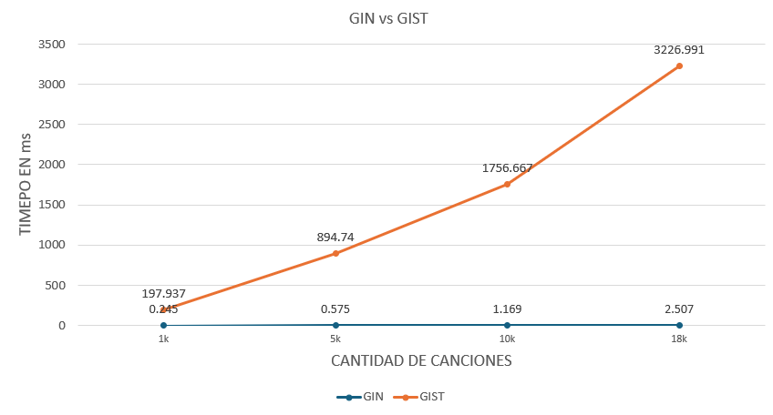

# Proyecto de Índice Invertido

## 1. Introducción
Este proyecto implementa un sistema de búsqueda basado en un índice invertido para una base de datos de letras de canciones. Con un enfoque en eficiencia y accesibilidad, el proyecto incluye una interfaz gráfica para consultas SQL-like, facilitando la interacción con los datos a través de un frontend intuitivo. Además, la implementación fue diseñada para ser comparable en rendimiento con bases de datos robustas como PostgreSQL.

## 2. Backend

### Índice Invertido
La base de este sistema de búsqueda es un índice invertido, una estructura que asocia cada término de la base de datos con los documentos en los que aparece, junto con la frecuencia y la posición. Para optimizar el rendimiento:
- El índice se divide en bloques almacenados en archivos `.txt`, con una estructura que sigue el formato: `término (DF: frecuencia de documento): (ID del documento, frecuencia)`.
- Esto permite que el índice sea escalable y eficiente para consultas de texto.

### Implementación SPIMI
Se utilizó el algoritmo SPIMI (Single-Pass In-Memory Indexing) para construir el índice invertido en bloques:
1. **Creación de bloques**: Se generan bloques parciales, cada uno almacenado en un archivo de texto.
2. **Merge de bloques**: Al finalizar la construcción de todos los bloques, se realiza un proceso de `mergeblock` para unirlos y optimizar el acceso y consulta al índice.

## 3. Frontend

### Parser SQL-like
El sistema de consulta SQL-like permite a los usuarios hacer preguntas al índice usando una sintaxis similar a SQL, facilitando la familiarización y flexibilidad en las búsquedas. Por ejemplo:
- `select title from Audio where content liketo 'yea you just cant walk away' limit 5'`

### Interfaz gráfica (Tkinter)
La interfaz gráfica, implementada en **Tkinter**, ofrece una experiencia de usuario sencilla y eficiente. Permite:
- Realizar consultas de texto usando el parser SQL-like.
- Visualizar los resultados de las búsquedas.
- Limpiar y reiniciar la interfaz para realizar nuevas consultas.

La GUI está diseñada para ser intuitiva y funcional, mejorando la experiencia de búsqueda en la base de datos de letras de canciones.

## 4. Experimentación

Se realizaron pruebas de rendimiento comparando el tiempo de respuesta de esta implementación en Python con el de PostgreSQL en consultas sobre diferentes tamaños de datos, con valores de N que varían entre 1,000 y 10,000.

### Resultados de la Comparación

| Tamaño de N | Tiempo (ms) - Índice Invertido (Python)| Tiempo GIN (ms) - PostgreSQL | Tiempo GIST (ms) - PostgreSQL | 
|-------------|----------------------------------------|------------------------------|-------------------------------|
| 1000        | X ms                                   | 0.245 ms                     | 197.937 ms                    |
| 5000        | X ms                                   | 0.575 ms                     | 894.740 ms                    |
| 10000       | X ms                                   | 1.169 ms                     | 1756.667 ms                   |
| 18000       | X ms                                   | 2.507 ms                     | 3226.991 ms                   |

En los resultados obtenidos, el índice GIN muestra tiempos de respuesta mucho menores en comparación con GIST. A medida que aumenta el tamaño de la tabla (cantidad de canciones), los tiempos de consulta con GIN se mantienen bajos, mientras que GIST presenta un incremento lineal en los tiempos de ejecución.

- Índice GIN: Es eficiente para consultas de texto completo debido a su estructura de índice invertido, permitiendo búsquedas rápidas en grandes volúmenes de texto. PostgreSQL utiliza un Bitmap Index Scan para este índice, optimizando aún más las búsquedas con múltiples términos.

- Índice GIST: Aunque es versátil, no es adecuado para búsquedas de texto completo en grandes volúmenes de datos. No utiliza un índice invertido ni un Bitmap Index Scan, lo que resulta en tiempos de ejecución más altos.

## 5. Conclusiones
Este proyecto demuestra la eficiencia y flexibilidad de un índice invertido en Python para realizar búsquedas de texto en una base de datos de letras de canciones. Si bien PostgreSQL ofrece ventajas en términos de optimización avanzada, la implementación de este índice invertido permite un control más detallado sobre las consultas y la estructura de datos.

---

