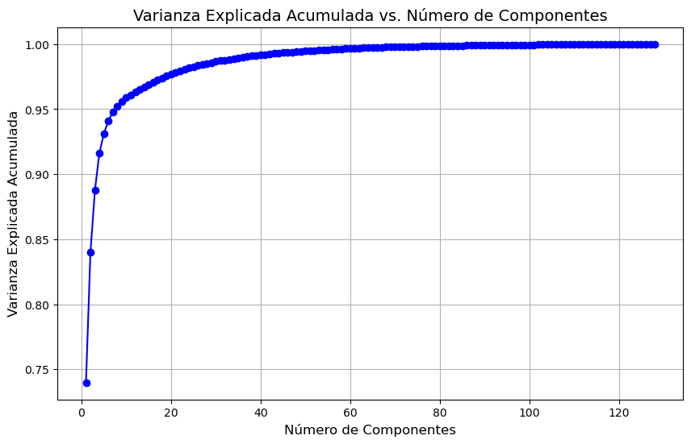

# Proyecto de Índice Invertido y Busquedas por cancion en mp3 sobre canciones de Spotify y 

<details>
    <summary> Sobre la data: </summary>

## Para el Proyecto 2

Se ha utilizado un csv con las canciones obtenido de https://www.kaggle.com/datasets/imuhammad/audio-features-and-lyrics-of-spotify-songs.

El cual contiene un track_id, con su información obtenida como: lyric, album_name, artists, genre, entre otras. 

## Para el Proyecto 3

Se ha usado datos dados encontrados en el repositorio: https://github.com/mdeff/fma/tree/master

Donde se ha descargado el fma_medium.zip con 25k de canciones (algunas de las cuales estaban corrompidas, pero una cantidad insignificante).

Y el raw_tracks.csv que contiene la informacion basada en un track_id, mismo nombre del archivo de la canción.

</details>

<details>
    <summary> Proyecto 2: Construccion de Spimi </summary>

## Introducción
Este proyecto implementa un sistema de búsqueda basado en un índice invertido para una base de datos de letras de canciones. Con un enfoque en eficiencia y accesibilidad, el proyecto incluye una interfaz gráfica para consultas SQL-like, facilitando la interacción con los datos a través de un frontend intuitivo. Además, la implementación fue diseñada para ser comparable en rendimiento con bases de datos robustas como PostgreSQL.

Su importancia se basa en busquedas textuales no exactas. Un ejemplo tenemos un buscador de productor, del cual sabemos su descripción que objeto es o que marca es. Y nos devuelve la busqueda mas parecida a nuestra consulta. Esto resulta importante, porque el usuario no tiene que saber los productos que existen en stock, solo necesita saber su necesidad para poder realizar una consulta eficiente.

## 2. Backend

### Índice Invertido
La base de este sistema de búsqueda es un índice invertido, una estructura que asocia cada término de la base de datos con los documentos en los que aparece, junto con la frecuencia y la posición. Para optimizar el rendimiento:
- El índice se divide en bloques almacenados en archivos `.txt`, con una estructura que sigue el formato: `término (DF: frecuencia de documento): (ID del documento, frecuencia)`.
- Esto permite que el índice sea escalable y eficiente para consultas de texto.

### Implementación SPIMI
Se utilizó el algoritmo SPIMI (Single-Pass In-Memory Indexing) para construir el índice invertido en bloques:
1. **Creación de bloques en Spimi Invert**: Se generan bloques parciales, cada uno almacenado en un archivo de texto.

    **Lógica de implementación**:
    
    El sistema lee una cancion, es decir un doc[i] del cual se extrae:

    ``` py
        col_text = [
        'lyrics', 'track_name', 'track_artist', 
        'track_album_name', 'playlist_name', 
        'playlist_genre', 'playlist_subgenre'
    ]
    ```

    Una vez procesado. El doc[i] se convierte en una liste de terminos, la cual llamaremos list_term_i.

    Ahora usaremos un diccionario de la libreria **SortedDict**, el cual actua como un arbol. Con el beneficio de manter un diccionario ordenado para los terminos, los cuales serán escritos en disco.
    
    De tal manera de tener la forma:

    | Word_for_term_i | df_word | posting_list            |
    |-----------------|---------|-------------------------|
    | word1           | 5       | [(1, 3), (2, 1)]        |
    | word2           | 8       | [(3, 4), (5, 2)]        |
    | word3           | 3       | [(6, 2), (7, 5)]        |
    
    En caso el doc[i] sea demasiado grande, se escribira solo hasta lo permitido de **4 kB**. Y lo demas se mantendra en el diccionario. De tal manera que se puedan escribir doc[i] en un solo bloque, con tal de que quepan en el espacio limite.

    <details>
        <summary>Parte del código: </summary>

    ```py
    def spimi_invert(self, token_stream, docId, num_block):
        for token in token_stream:
            if token not in self.global_dictionary:
                posting_block = PostingBlock()
                self.global_dictionary[token] = {
                    'df': 1,
                    'posting_block': posting_block
                }
                posting_block.add_doc(docId)
                self.global_block_size += sys.getsizeof(token) + sys.getsizeof(self.global_dictionary[token])
            else:
                posting_block = self.global_dictionary[token]['posting_block']
                doc_found = False
                while posting_block:
                    if docId in posting_block.doc_dict:
                        posting_block.doc_dict[docId] += 1
                        doc_found = True
                        break
                    if posting_block.next_block is None:
                        break
                    else:
                        posting_block = posting_block.next_block
                if not doc_found:
                    self.global_dictionary[token]['df'] += 1
                    if posting_block.is_full():
                        new_posting_block = PostingBlock()
                        posting_block.next_block = new_posting_block
                        posting_block = new_posting_block
                    posting_block.add_doc(docId)
                    self.global_block_size += sys.getsizeof(docId)
            if self.global_block_size >= self.size_per_block:
                self.write_block_to_disk(self.global_dictionary, num_block)
                self.global_dictionary = SortedDict()
                self.global_block_size = 0
                num_block += 1
        return num_block
    ```

    </details>

2. **Merge de bloques**: Al finalizar la construcción de todos los bloques, se realiza un proceso de `mergeblock` para unirlos y optimizar el acceso y consulta al índice.

    **Input:** Diccionario de <bloque_name> y <path_block>.

    **Logica:** El proceso recibe como parametros un factor de bloque de salida, que determina el tamaño que debe tener cada bloque final (**4kB** aproximadamente) y el tamaño de ram dedicada para el heap. 

    Lo que se intenta hacer es primero. Abrir todos los archivos por grupos, con el objetivo de usar poca ram. Y por cada archivo dentro de ese bloque carga un buffer, cuyo tamaño se obtiene de $(self.max_ram_limit - self.block_size_limit) // len(block_files)$.  Cada buffer es cargado al heap.

    ```py
    for file_group in file_groups:
    open_files = {file_id: open(file_path, 'r') for file_id, file_path in file_group.items()}
    for file_id, file in open_files.items():
        file_positions[file_id] = file.tell()

    for file_id, file in open_files.items():
        buffer = []
        buffer_size = 0
        while buffer_size < max_memory_per_block:
            line = file.readline().strip()
            if not line:
                break
            term, df, posting_block = self.parse_block_line(line)
            buffer.append((term, df, posting_block))
            buffer_size += sys.getsizeof(term) + sys.getsizeof(df) + sys.getsizeof(posting_block)

        input_buffers[file_id] = buffer

        # Insertar elementos del buffer en el heap
        for term, df, posting_block in buffer:
            heapq.heappush(heap, (term, df, file_id, posting_block))
    for file in open_files.values():
        file.close()
    ```

    De tal menera que se tiene un buffer activo por archivo de bloque, si en caso el buffer se queda vacio, se vuelve a cargar el buffer.

    En este caso, usamos un file_positions, para guardar la linea donde se quedó el buffer dentro del archivo.

    ```py
    if not input_buffers[file_id]:
        with open(block_files[file_id], 'r') as file:
            file.seek(file_positions[file_id])
            buffer = []
            buffer_size = 0
            while buffer_size < max_memory_per_block:
                line = open_files[file_id].readline().strip()
                if not line:
                    break
                term, df, posting_block = self.parse_block_line(line)
                buffer.append((term, df, posting_block))
                buffer_size += sys.getsizeof(term) + sys.getsizeof(df) + sys.getsizeof(posting_block)
            input_buffers[file_id] = buffer
            file_positions[file_id] = file.tell()

        # Agregar nuevos términos del buffer al heap con fusión de duplicados
        for term, df, posting_block in buffer:
            heapq.heappush(heap, (term, df, file_id, posting_block))
    ```

    De tal menera que mientras el heap tenga datos, se extrae el minimo y se inserta en el ouput verificando que ya no exista, en caso exista se junta con la data ya tenida.

    Ademas se usa un contador para ver si ya el output alcanzó el tamaño de salida, cuando sea así, se escribe en disco en el directorio final. Que será ya usado para las consultas.

## 3. Frontend

### Parser SQL-like
El sistema de consulta SQL-like permite a los usuarios hacer preguntas al índice usando una sintaxis similar a SQL, facilitando la familiarización y flexibilidad en las búsquedas. Por ejemplo:
- `select title from Audio where content liketo 'yea you just cant walk away' limit 5'`

### Interfaz gráfica (Tkinter)
La interfaz gráfica, implementada en **Tkinter**, ofrece una experiencia de usuario sencilla y eficiente. Permite:
- Realizar consultas de texto usando el parser SQL-like.
- Visualizar los resultados de las búsquedas.
- Limpiar y reiniciar la interfaz para realizar nuevas consultas.

La GUI está diseñada para ser intuitiva y funcional, mejorando la experiencia de búsqueda en la base de datos de letras de canciones.

## 4. Experimentación

Se realizaron pruebas de rendimiento comparando el tiempo de respuesta de esta implementación en Python con el de PostgreSQL en consultas sobre diferentes tamaños de datos, con valores de N de 1k, 5k, 10k y 18k.

Esto se encuentra en la ruta: /Proyecto2/Experimentacion.ipynb 

### Resultados de la Comparación

| Tamaño de N | Tiempo (ms) - Índice Invertido (Python) Promediado en 5 veces | Tiempo GIN (ms) - PostgreSQL | Tiempo GIST (ms) - PostgreSQL | 
|-------------|----------------------------------------|------------------------------|-------------------------------|
| 1000        | 175,059 ms                                   | 0.245 ms                     | 197.937 ms                    |
| 5000        | 320,940 ms                                   | 0.575 ms                     | 894.740 ms                    |
| 10000       | 377,610 ms                                   | 1.169 ms                     | 1756.667 ms                   |
| 18000       | 971,799 ms                                   | 2.507 ms                     | 3226.991 ms                   |


En los resultados obtenidos, el índice GIN muestra tiempos de respuesta mucho menores en comparación con GIST. A medida que aumenta el tamaño de la tabla (cantidad de canciones), los tiempos de consulta con GIN se mantienen bajos, mientras que GIST presenta un incremento lineal en los tiempos de ejecución.

- Índice GIN: Es eficiente para consultas de texto completo debido a su estructura de índice invertido, permitiendo búsquedas rápidas en grandes volúmenes de texto. PostgreSQL utiliza un Bitmap Index Scan para este índice, optimizando aún más las búsquedas con múltiples términos.

- Índice GIST: Aunque es versátil, no es adecuado para búsquedas de texto completo en grandes volúmenes de datos. No utiliza un índice invertido ni un Bitmap Index Scan, lo que resulta en tiempos de ejecución más altos.

En el caso de la implementacion de Spimi, los tiempos son menores que el indice GIST pero mayores que el indice GIN. Dicha diferencia se infiere que es por la cantidad de bloques que se tienen que buscar, ademas que un word puede estar en mas de un bloque, por la cantidad de terminos que tenga, por lo que una vez encontrada la word en el archivo, hay que buscar en sus vecinos hasta que no encuentre. La busqueda en memoria secundaria de tal manera, ademas de la carga por lineas para la busqueda resulta en dicha diferencia. Sin embargo, los tiempos son los esperados, siendo imperseptibles para el usuario, pues su aumento por la cantidad de datos, no es exponencial, a los mas polinomial.

## 5. Conclusiones
Este proyecto demuestra la eficiencia y flexibilidad de un índice invertido en Python para realizar búsquedas de texto en una base de datos de letras de canciones. Si bien PostgreSQL ofrece ventajas en términos de optimización avanzada, la implementación de este índice invertido permite un control más detallado sobre las consultas y la estructura de datos. Aunque presenta la desventaja de creacion de bloques, y que es estática.


---

</details>

<details>
    <summary> Proyecto 3: Busquedas multidimensionales sobre canciones </summary>

## Introducción:

En esta parte se ha realizado extracción de características de canciones, con el objetivo de realizar busquedas por similitud a partir de una canción como query. De tal manera de poder implementar algo parecido a lo que hace Shazam.

## Backend: Indice Multidimensional

El backend para este indice se ha realizado a partir de la extracción de características, extraídas por bloques de 1000 canciones, guardadas en un pkl de la forma (track_id, features_vector) con la librería librosa. Se ha extraido 128 características, de las cuales se ha prodediado los frames, de tal manera que se tiene 128 caracteristcias para un promedio de frames. 

Las características extraídas son 128 dimensionales, y se ha utilizado una técnica de agrupación para reducir la cantidad de datos procesados, calculando el promedio de los vectores de características de cada frame de audio. Este paso es fundamental para reducir el uso de memoria RAM, ya que de no hacerlo, se tendrían 128 características por cada frame, y cada canción podría contener más de 2500 frames. Con este enfoque, conseguimos reducir el tamaño de los vectores y hacer posible la creación de un índice local que pueda ser utilizado de manera eficiente durante la búsqueda.

A pesar de que la opción de almacenar los datos en memoria secundaria fue considerada, se desestimó por razones de agilidad y rendimiento. Con este enfoque, la carga en memoria se mantiene dentro de límites razonables, y el acceso a los datos es más rápido, lo que es crucial para los tiempos de respuesta del sistema de búsqueda.

Las canciones utilizadas en el proyecto provienen de un repositorio en GitHub (mencionado previamente) y deben ser ubicadas en la carpeta "Proyecto3/". Una vez colocadas las canciones en esa ubicación, el código correspondiente a la extracción de características debe ejecutarse mediante el script Proyecto3/extractFeatures/extractFeatures.py.

### Knn Search y Range Search:

Para el Knn Search se ha implementado un minHeap optimo para poder utilizarse en la estructura. Se ha realizado dos métodos de busqueda **knn_heap_query** que recibe: query procesada en mfcc y el k (k vecinos mas cercanos) y el range_query que recibe la query procesada y un radio r de busqueda.

- Consideraciones:
    
    **Calculo de la distancia:** Distancia Euclediana entre la query y el vector de características del conjunto de canciones

    **Analisis de distribución para el rangeSearch:**

    **Code:**
    
    ```py
    def knn_heap_query(self, query_mfcc: np.ndarray, k: int) -> List[Tuple[str, float]]:
        result_heap = OptimizedHeap()

        for track_id, mfcc in self.collection:
            dist = np.linalg.norm(mfcc - query_mfcc)
            node = DistanceNode(distance=dist, track_id=track_id)

            if result_heap.size() < k:
                result_heap.push(node)
            elif result_heap.top().distance > dist:
                result_heap.replace_top(node)

        return [(node.track_id, node.distance) for node in result_heap.heapsort()]

    def range_query(self, query_mfcc: np.ndarray, r: float) -> List[Tuple[str, float]]:
        result = []
        for track_id, mfcc in self.collection:
            dist = np.linalg.norm(mfcc - query_mfcc)
            if dist <= r:
                result.append((track_id, dist))
        return result
    ```

#### Análisis de distribución de la distancia:

Para el análisis se ha calculado la distancia a cada punto en el diccionario global.

```py
def calculate_distances(dic_all, query_features):
    distances = []

    for track_id, features_vector in dic_all:
        dist = np.linalg.norm(features_vector - query_features)  # Distancia Euclidiana
        distances.append(dist)

    return distances
```

De tal manera que se obtiene:


Se ha calculado los percentiles con numpy y se ha obtenido:

| Percentil (%) | Radio elegido (distancia) |
|---------------|---------------------------|
| 90            | 214.97                    |
| 70            | 174.00                    |
| 50            | 144.37                    |
| 30            | 117.80                    |
| 10            | 87.73                     |

- Percentil 90: 90% de las distancias son ≤ 214.97. Cubre la mayoría de los puntos cercanos.

- Percentil 70: 70% de las distancias son ≤ 174. Ofrece un rango intermedio.

- Percentil 50 (Mediana): 50% de las distancias son ≤ 144.37. Un balance entre precisión y cobertura.

- Percentil 30: 30% de las distancias son ≤ 117.80. Incluye menos puntos, pero más cercanos.

- Percentil 10: 10% de las distancias son ≤ 87.73. Solo los puntos más cercanos.

Para la experimentación se va a usar un radio de 88, para recuperar por lo menos el 10%.

### RTree Search

Para las busquedas por RTree se ha utlizado el index *rtree_index* de la librería **rtree** de python.

Este indice permite realizar busquedas eficientes en espacios multidimensionales. El cual recibe la colección de features mfcc extraidos, un parámetro **m** que indica cuantos elementos se pueden almacenar por nodo y el parámetro **dimensions** que es el número de características, en este caso 128 dimensiones.

La lógica que sigue es convertir cada vector en un conjunto de coordenadas que representan un punto en el espacio multidimensional. Dicho punto se inserta en el rtree donde se utiliza el ID del objeto (en este caso, el índice de la canción en la colección) y las coordenadas duplicadas del vector de características (para crear un rectángulo que rodee el punto en el R-Tree).


```py
def __init__(self, m: int, collection: List[Tuple[str, np.ndarray]]) -> None:
    p = rtree_index.Property()
    p.dimension = collection[0][1].shape[0]  # Número de dimensiones del vector MFCC
    p.buffering_capacity = m  # Capacidad de almacenamiento del nodo
    self.collection = collection
    self.idx = rtree_index.Index(properties=p)

    for i in range(len(collection)):
        coordinates = tuple(collection[i][1])
        self.idx.insert(id=i, coordinates=(coordinates + coordinates))  # Inserción en RTree
```

**Análisis de m:**

Para el m_óptimo se ha considerado pruebas para diferente **m** en este caso: [10, 30, 50, 70, 100]. Además todos se han construido sobre el indice global de casi 25k de canciones convertidas a features vector

Los resultados fueron:

| m         | Tiempo (segundos)     |
|----------------|-----------------------|
| 10    | 0.1141                |
| 30    | 0.1551                |
| 50    | 0.0875                |
| 70    | 0.1100                |
| 100   | 0.1314                |

Por lo tanto el **m** ótimo para las experimentaciones es 50.

**Sobre la consulta:**

La consulta recibe la query procesada y los k vecinos mas cercanos. La query es procesada y convertida a un coordenadas y si es necesario se duplican para que coincidan con el rtree. Con *nearest* se obtiene los k vecinos mas cercanos. Una vez hecho, se calcula la distancia euclidiana para cada punto encontrado y se ordenada bajo esa distancia.

```py
def query(self, query_mfcc: np.ndarray, k: int) -> List[Tuple[str, float]]:
    coordinates = tuple(query_mfcc)
    if len(coordinates) == self.idx.properties.dimension:
        coordinates = coordinates + coordinates  # Duplicar coordenadas para RTree

    nearest = self.idx.nearest(coordinates, num_results=k)  # Consultar vecinos más cercanos
    result = []
    for item_id in nearest:
        obj = self.collection[item_id]
        result.append((obj[0], np.linalg.norm(obj[1] - query_mfcc)))  # Distancia Euclidiana
    return result
```

### HighD Search

#### Análisis de la maldición de la dimensionalidad

En nuestro contexto contamos con features vectors mfcc de 128 dimensiones que describen la "firma acústica" de una canción.

En tal contexto, la gran cantidad de dimensiones afectaría al calculo de la distancia entre puntos en el espacio. Las consecuencias serían:

- **Disminución de la discriminación de las distancias:** En altas dimensiones, las distancias entre puntos tienden a igualarse, lo que hace dificirl la distincion.

- **Escalabilidad de los algoritmos:** Con el aumento de dimensiones, y aumento de datos, la complejidad computacional aumenta. Lo que resulta que el Knn_Sequential o Knn_Rtree tiendan a ser demasiados costosos.

- **Mayor almacenamiento y tiempo de consulta:** El aumento de dimensionalidad tiene un costo grande almacenamiento y proceso. Que implica una demanda de recursos.

#### Mitigación mediante FAISS

Faiss es una libreria optmizada desarrollada por Facebook, se encuentra en: https://github.com/facebookresearch/faiss. Su objetivo es proporcionar soluciones eficientes para problemas de búsqueda de vecinos cercanos en espacios de gran dimensionalidad, lo que la convierte en una herramienta ideal para nuestro caso de uso con vectores MFCC de 128 dimensiones

**Índices Disponibles:** LSH, IVF (Inverted File), HNSW (Hierarchical Navigatable Small World Graphs)

### ¿Por qué LSH?

LSH o Locality-Sentive Hashing se ha escogido por:

- **Eficiencia para altas dimensiones:** Como estamos trabajando con datos multidimensionales, faiss soporta dicho requerimiento, ya que permite realizar búsquedas de vecinos más cercanos de una manera rápida, pues utiliza cajas (hash)
para mapear la busqueda.

- **Control sobre Precisión y velocidad:** Faiss permite controlar la cantidad de bits que se traduce en precisión de la consulta, a mayor cantidad de bits, mayores recursos requeridos.

- **Facilidad de implementación:** Faiss se puede implementar de manera sencilla que HNSW e IVF, lo que facilita su mantenimiento.

- **Escalabilidad y bajo requerimiento de Memoria:** Es mas eficiente es espacio de memoria, pues no requiere de grandes cantidades de centroides (IVF) o una estructura de grafo compleja (HNSW). Lo cual es importante porque el sistema debe manejar grandes cantidades de datos y el consumo de memoria debe mantenerse controlado.


-----
**¿Por qué no IVF?**

Porque aunque IFV es más exacto que LSH, tiene un alto costo computacional de entranamiento para los clusters y requiere más memoria.

**¿Por qué no HNSW?**

A pesar de ser la opción con mejor precisión y tiempo de busqueda (teoricamente) presenta un mayor uso de memoria y mayor costo de tiempo de construcción. Además que el tiempo de busqueda puede llegar a ser mas costoso en grandes cantidadades de datos.

#### Funcionamiento de LSH:

LSH mapea los vectores de alta dimension a una representación de menor dimensión mediante el uso de funciones **hash**. Dicha función se crea de tal manera que los vectores similares tengan una alta probabilidad de tener el mismo valor de hash, mientras que los vectores diferentes se alojen en otro valor de hash.

La cantidad de bits se refiere al número de bits para representar el valor del hash. De tal manera que a mayor cantidad de bits, hay menos colisión, es decir 
mayor precisión. Sin embargo, también puede inducir a cajas más dispersas que resulta en mayor tiempo de consulta. Con una menor cantidad de bits la busqueda se vuelve más rápida, pero puede devolver falsos-positivos (vectores disímiles asignados al mismo valor de hash), lo que reduce la precisión.

Esta agrupación por cajas resulta en:

- **Reducción de dimensionalidad:** LSH reduce la complejidad de las comparaciones al mapear vectores similares a la misma "caja", lo que significa que las comparaciones de distancias se realizan solo entre los vectores que tienen un hash similar, en lugar de entre todos los vectores del conjunto de datos.

- **Mejora de velocidad:** Como se usa un hash, las consultas a las cajas de vectores similares es mucho más rápida.


#### Explicación del código:

Para la construcción, se recibe la colección de features vectors, se extrae la cantidad de dimensiones usadas y se construye el LSH con esas dimensiones **d** y una cantidad de bits, para luego agregar los vectores característicos al índice.

```py
class KNN_HighD:
    def __init__(self, num_bits: int, collection: List[Tuple[str, np.ndarray]]) -> None:
        self.collection = collection
        d = collection[0][1].shape[0]  # Dimensiones del vector MFCC
        self.index = faiss.IndexLSH(d, num_bits)  # Creación del índice LSH de FAISS
        self.index.add(np.ascontiguousarray(np.asarray([i[1] for i in self.collection], dtype="float32")))
```

La consulta recibe la query procesada en los mfcc de 128 dimensiones y un número **k** (k vecinos más cercanos). Y, mediante el método search del índice obtiene los k vecinos más cercanos. Para finalmente ordenar por la distancia de cada vecino recuperado y la consulta.

```py
def knn_query(self, query_mfcc: np.ndarray, k: int) -> List[Tuple[str, float]]:
    query_mfcc = np.asarray([query_mfcc], dtype="float32")
    ranking, id_array = self.index.search(query_mfcc, k)  # Búsqueda en el índice

    result: List[Tuple[str, float]] = []
    for idx in id_array[0]:
        if idx == -1:
            continue
        obj = self.collection[idx]
        dist = np.linalg.norm(obj[1] - query_mfcc[0])  # Distancia Euclidiana
        result.append((obj[0], dist))
    return sorted(result, key=lambda x: x[1])  # Ordenar por distancia
```

#### Elección de la mejor cantidad de bits:

Se ha ejecutado el código con el diccionario global para la mejor cantidad de bits calculando el promedio de 5 ejecuciones. De tal manera que la tabla quedó:

### Resultados por cantidad de bits

| Cantidad de Bits        | Tiempo Promedio (segundos)     |
|-------------------------|--------------------------------|
| knnHighD_for_64_bits    | 0.00019989013671875           |
| knnHighD_for_8_bits     | 0.00020012855529785156        |
| knnHighD_for_128_bits   | 0.00020055770874023439        |
| knnHighD_for_256_bits   | 0.00020060539245605468        |
| knnHighD_for_16_bits    | 0.00039992332458496096        |
| knnHighD_for_32_bits    | 0.0004000663757324219         |
| knnHighD_for_512_bits   | 0.0006001472473144531         |

En tal sentido se ha seleccionado 128 bits. si bien no es el mejor tiempo, pero se considera también la precisión. Se espera que esta cantidad de bits esté balanceada.

## Experimentación

Consideraciones:

- k: 10
- r: 88
- Se ha calculado un promedio en 5 ejecuciones de consulta

### Datos sin reducción PCA:

| N     | Knn_Sequential (s) | Knn_Range (s) | Knn_RTree (s) | Knn_HighD (s) |
|-------|--------------------|---------------|---------------|---------------|
| 1000  | 0.006915           | 0.009475      | 0.002485      | 0.0002        |
| 5000  | 0.023078           | 0.029422      | 0.013189      | 0.000801      |
| 10000 | 0.044055           | 0.064166      | 0.026107      | 0.0002        |
| 20000 | 0.1044             | 0.141708      | 0.069932      | 0.0003992     |
| 24980 | 0.130279           | 0.169392      | 0.094846      | 0.0002003     |


En el grafico se puede denota que la linea de tendencia del HighD es mucho mejor que las otras, lo cual denota que logra hacer una excelente reducción de la dimensionalidad. Así mismo se observa que el rtree se comporta mejor que el sequential y que el range_Search. Pero mucho mas costoso que el high con LSH

### Datos con reducción de PCA:

Para la cantidad de componentes se ha hecho un analisis de la varianza sobre el diccionario de los 25k de elementos.



En cuyo caso se observa que el **nro_componentes** que conserva un 98.5% de la información es para **28** componentes.

Los datos obtenidos para la experimentación son:


| N     | Knn_Sequential (s) | Knn_Range (s) | Knn_RTree (s) | Knn_HighD (s) |
|-------|--------------------|---------------|---------------|---------------|
| 1000  | 0.008814           | 0.009215      | 0.001064      | 0.000201      |
| 5000  | 0.025089           | 0.026535      | 0.003954      | 0.000199      |
| 10000 | 0.049314           | 0.045227      | 0.008647      | 0.0002        |
| 20000 | 0.101501           | 0.120315      | 0.018291      | 0.000199      |
| 24980 | 0.13188            | 0.109363      | 0.022462      | 0.0002        |


En este gráfico se observa que tanto el sequential como el range se mantienen a un tiempo parecido. Y el crecimiento del rtreee ha disminuido considerablemente.

## Conclusiones

En general para una busqueda optimca para datos multimedia con gran cantidad de dimensiones se recomienda el uso de faiss con LSH de Faiss. Y se ha observado que el rtree no conviene ante casos de multidimensiones.

</details>

## Descargas complementarias:

Para el proyecto 2:

- https://drive.google.com/drive/folders/1VRW1GGG7dLcTVoPp3OLgzAjz2nWtYVOg?usp=sharing: bloques ya creados para las busquedas por similitud.

Para el proyecto 3 (opcional):

Del github: https://github.com/mdeff/fma/tree/master?tab=readme-ov-file

- https://os.unil.cloud.switch.ch/fma/fma_medium.zip: zip de canciones en caso requieran instalar las canciones.

- https://os.unil.cloud.switch.ch/fma/fma_metadata.zip: zip de metadata de las canciones. Se usa el raw_tracks.